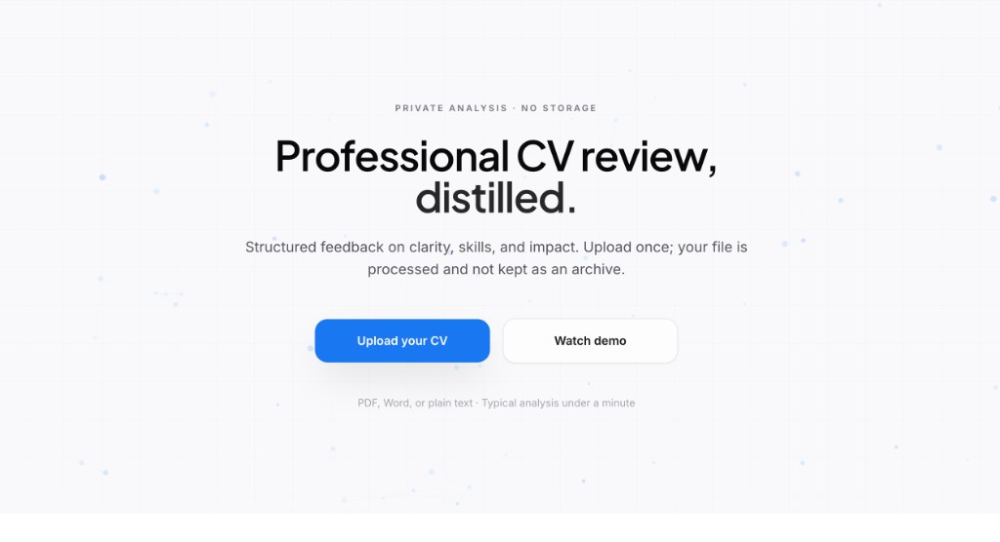

# CVNalys

[](https://www.python.org/downloads/)
[](LICENSE)

AI-assisted CV analysis in the browser: upload a resume, get a score, skills breakdown, recommendations, optional AI-written insights, and CV rewrite — with privacy-minded handling (no long-term CV archive in the default flow).

**Stack:** Flask · OpenAI **GPT-5** family ([Chat Completions](https://platform.openai.com/docs/api-reference/chat)) · PyPDF2 / python-docx · Tailwind (CDN) · Hammer.js

## App snapshot

<p align="center">
  
</p>

## Features

- PDF, DOCX, DOC, TXT, RTF (up to 16 MB)
- Heuristic analysis + optional **OpenAI** insights and **rewrite**
- Responsive UI (touch gestures via Hammer.js)
- Configurable **CORS**, security headers, and session cookies for production

## Quick start

```bash
git clone https://github.com/OpenAI4Africa/CVNalys.git
cd CVNalys
python3 -m venv venv
source venv/bin/activate   # Windows: venv\Scripts\activate
pip install -r requirements.txt
cp env.example .env
# Edit .env — at minimum set SECRET_KEY; set OPENAI_API_KEY for full AI features
python run.py
```

Open **http://localhost:8000** (or the port `run.py` prints if 8000 is busy).

## Configuration (`.env`)

| Variable | Required | Notes |
|----------|----------|--------|
| `SECRET_KEY` | Yes | Strong random string for sessions |
| `OPENAI_API_KEY` | No* | Enables AI insights + CV rewrite |
| `OPENAI_CHAT_MODEL` | No | Defaults to **`gpt-5.4-mini`**. Use e.g. `gpt-5.4` for flagship quality or another [documented](https://platform.openai.com/docs/models) GPT-5 snapshot your key supports |
| `CORS_ORIGINS` | No | Comma-separated origins when calling the API cross-origin |
| `FLASK_ENV` / `PRODUCTION` | No | `production` / `1` for secure cookie flags |

\*Without an API key, basic scoring and rules still run; AI sections are limited.

## GPT-5 models

This project targets the **GPT-5** line (`gpt-5.4`, `gpt-5.4-mini`, `gpt-5.2`, etc.). Pick a model ID from the [OpenAI models](https://platform.openai.com/docs/models) docs that your account can access, and set `OPENAI_CHAT_MODEL` accordingly. The default `gpt-5.4-mini` is a practical balance of cost and latency for CV analysis.

## Project layout

```
cvnalys/
├── app/
│   ├── __init__.py
│   ├── routes.py
│   ├── services/cv_analyzer.py
│   ├── utils/
│   ├── static/          # css, js
│   └── templates/
├── run.py
├── requirements.txt
├── env.example
└── README.md
```

## Security & privacy

- Prefer HTTPS and a strong `SECRET_KEY` in production.
- Restrict `CORS_ORIGINS` to real front-end origins.
- CVs are processed for analysis; design your deployment so files are not kept longer than needed.

## Contributing

Issues and PRs welcome. Fork → branch → change → test → open a pull request.

## License

Apache 2.0 — see [LICENSE](LICENSE).

## Credits

Built with [OpenAI](https://openai.com) APIs · [OpenAI4Africa](https://openai4africa.org) · [SISU AI](https://sisuai.com)
